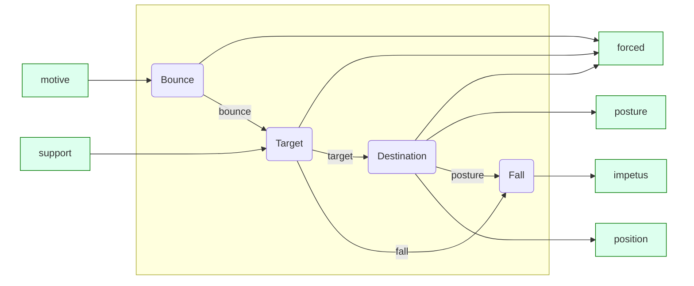

# Mount Pyoro Design Doc

## Elevator Pitch

Mount Pyoro is a puzzle platformer with discrete time and space.

## Conventions

MOSTLY means a prescription is not expected to be applicable without exception,
but exceptions probably should be justified by some other consideration.

The coordinate system is such that `x` increases to the right, and `y`
increases down, in the direction of gravity.

## Influences

### Platforming

- [Celeste](https://store.steampowered.com/app/504230/Celeste/)
- [Leap Year](https://store.steampowered.com/app/2951770/Leap_Year/)
- [Spelunky](https://store.steampowered.com/app/239350/Spelunky/)
- Classic platformers like Mario, Sonic, etc.

### Puzzles

- [Isles of Sea and Sky](https://store.steampowered.com/app/1233070/Isles_of_Sea_and_Sky/)
- [Baba is You](https://store.steampowered.com/app/736260/Baba_Is_You/)
- [Stephen's Sausage Roll](https://store.steampowered.com/app/353540/Stephens_Sausage_Roll/)
- [Escape](http://escape.spacebar.org/)

### Misc

- [Time Badgers](https://github.com/gwillen/timebadgers)

## Goals

### Narrative Structure

- The world is broken up into "rooms".

- The game should feel somewhat "open-world". It may be linear-ish in
  parts, but there should be some branching freely chosen by the
  player.

- The game is won by gaining access to the final room. In general, the
  carrot that is offered to players is gaining access to places. It is desirable
  to tease the existence of places before they're accessible.

- There should be some indication of when a room is "finished".

### General Physics

- There is a notion of gravity, and therefore a notion of "up". It
  should be challenging --- and therefore rewarding --- to get to
  "high-up" stuff.

- There should ways the player can move that feel "fun" or "exciting"
  or "surprising" in and of themselves, even when performed in
  discrete steps of time. A core motivation for this game is that I
  want to be able feel the cool feelings of playing Celeste --- the
  feeling of making just the right dash or dodge or getting a tricky
  long jump perfect --- despite the fact that I suck at
  platformers.

  - This is a difficult constraint, because one thing that makes Celeste
    exciting is the skill gap between planning and execution of a plan.
    I don't want to make it actually hard to execute a plan, but I do
    want to cultivate the *illusion* of drama, (tension,
    time-sensitiveness, the player being in danger) as much as possible.

- Barring discontinuous motion like teleporters, the player should
  only move one cell per "tick", (allowing diagonals) even when
  notionally they have high "velocity", which is called "impetus"
  in an attempt to avoid confusion. High impetus
  can instead manifest as
    - ease in continuing motion against an external force (the
      canonical example being upward "velocity" permitting motion
      against the direction of gravity)
    - difficulty in *reversing* direction relative to that velocity
    - a notion of "collision with high force" when collisions happen
      which could be advantageous (e.g. to break certain kinds of blocks)
      or disadvantageous (e.g. leading to fall damage).

- Physics should be invariant to left-right flipping, but is very much not
  required to be invariant to up-down flipping, because of gravity.

- ("Determinism") Physics should be deterministic. Given same state, same motion,
  yield same output. No random boss moves like in Isles of Sea and
  Sky.

- ("Unimodality") Unsupported vertical motion should be "unimodal".
  Any sequence of unsupported moves should have at most one
  "ascending" subsequence followed by at most one "descending"
  subsequence. In freefall, we shouldn't be able to wiggle around
  vertically, or even pause and resume ascent, without some kind of
  exceptional situation that "explains" the change in vertical
  velocity. Legitimate exceptions include: landing on solid ground,
  wall-grabs, or encountering some kind of bonus that gives us more
  vertical impetus.

- ("Small Jumps") In the absence of any barriers, when an entity wants
  to move up, laterally, or up-diagonally from a normal supported
  state, with zero impetus, its destination coincides with its motive,
  with a resultant zero impetus.

- ("Gap Running") A player can walking continuously across a floor
  with at most one-tile gaps, with a constant impetus of (0,0).

- All entities, player and otherwise, should MOSTLY have the same
  physics interactions with the rest of the world.

- The physics of the world should MOSTLY strive to exclude situations where the player is at the same place as a filled block.

### Low-Level Physics

- Each entity has in its state a **impetus**, an integer valued vector
  relative to that entity. This is something like a velocity vector,
  but can have significant intuitive differences.

- An entity beginning a tick with nonzero impetus tends to move in the
  direction of its impetus, with "voluntary" changes being a
  correction to that motion.

The state passed through the phases of physics tick update are

- **motive**: a vector, a direction the entity is "trying" to move.
- **impetus**: a vector, as described above.
- **target**: a point in world space, a sort of provisional destination.
- **destination** a point in world space.
- **forced block set**: a set of tile positions paired with vectors. These
  are blocks in the world that have forces "applied" to them by entity motion.
  Those tiles can do other things based on that information.

The phases of the tick update computation are:
- **bounce phase**: Let entity interact with motive tile, producing bounce.
- **target phase**: Let impetus affect entity, producing target.
- **destination phase**: Let entity interact with target tile, producing destination.
- **fall phase**: Adjusted impetus according to gravity if required.
- **collision phase**: Resolve entity-entity collisions.

The target phase has two alternatives, supported and unsupported.
The unsupported target phase can be further subdivided into computing
the horizontal and vertical components of motion.

#### Diagram

This is approximate. Not all data flow is represented.
In particular, all phases have access to entity position and impetus.

#### Bounce Phase

The motive may be directing us to move into a cell that is already
full. We want to revise it to the *bounce* direction, which at least
attempts to move to an open cell. A cell is *open* if its tile admits
movement into it. This is defined per-tile. We always consider the
entity's own cell to be open for the purposes of this phase.

In order to find the bounce direction, we iterate through some
candidate approximations to the target, picking the first one that is
"clear", which is a slightly stronger condition than "open", as it may
involve checking openness of other nearby cells. The "vertical
projection" of a vector means what you get when you set the x
component to zero, and "horizontal" likewise what you get from setting
the y component to zero.

- The preferred direction is the target itself. This direction is
  considered clear if the target is open, *and the vertical
  approximation* of the target is also open. This prevents diagonal
  movement when there is no "headroom", as well as preventing slipping
  through "diagonal cracks".

- The next most preferred direction is the horizontal approximation
  of the target. This motion is considered clear if the direction is
  open.

- The next most preferred direction is the vertical approximation of
  the target. This motion is considered clear if the direction is
  open.

- Finally, if all of the above directions are not clear, set the
  bounce direction to the current position of the entity.

If we didn't bounce to the motive itself, add to the set of forced
tiles the *last* proposed bounce that wasn't used, with the force
vector being the impetus.

#### Target Phase (Supported)

If the entity is supported by a block opposing the direction of the
motive, then the target is exactly where the bounce direction is.
The resulting impetus by default is zero, but the nature of the supporting
block might change this.

Add the supporting block as a forced block, with force vector being
the "vector of support", which I leave for now to be defined on a
case-by-case basis.

For example, a block supporting player from below adds itself as
forced with vector `(impetus.x, max(impetus.y, 1))`

A side-grabbable block supporting a player adds itself as forced with
vector (1,0) or (-1,0) depending on whether the player is grabbing it
from the left or right. Here I'm relying on the grabbed state as
having zero impetus.

#### Target Phase (Unsupported, Vertical Component)

Assuming the entity is unsupported, we split cases.

If the impetus and bounce are *both* negative, then we are still
ascending. Vertical target is one square up, and vertical impetus
is increased by one due to gravity.

Otherwise, we are falling, either involuntarily (due to impetus) or
somewhat voluntarily (due to bounce). It is intentionally
"unrealistic" that we can choose to "exit" a jump at any time.
Vertical target is one square down, and vertical impetus is set to

$$ \max(\mathrm{impetus}_y, \mathrm{bounce}_y - 1) $$

NOTE: because of this, I think there's a very small amount of slightly
surprising control the player has regarding their motion immediately
after exiting a jump. They get different values from exiting "down"
(namely: 0) vs. "right" (namely: -1). This could be the crux of a
puzzle.

**XXX**: Discuss the `fall` boolean, and why the impetus calculation
above doesn't include it.

#### Target Phase (Unsupported, Horizontal Component)

We split cases on the sign of the horizontal impetus.
If the impetus is zero, the target is exactly where the bounce is.
The next-tick impetus stays zero.

If the impetus is non-zero, then the target is one square in the
direction of the impetus. The next-tick impetus reduces the magnitude
of the impetus by 1 towards zero, unless the bounce is also non-zero,
and in the **same** direction as the impetus.

#### Destination Phase

The destination phase is another "bounce"-like phase.
To compute the destination from the target does the same iteration
as bounce. The only difference is we also compute a posture.

**XXX**: describe this.

#### Collision Phase

- After all entities have been moved to their destination, resolve
  collisions. Some types of entities might have precedence over
  another. "Bouncing" entities is not allowed at this stage, only
  entity destruction. Mutual destruction is always an option if there
  are equal-precedence entities colliding.

### Puzzles

- Puzzles MOSTLY come from unexpected interactions between puzzle
  mechanisms, and/or unexpected corner cases thereof. Some of my
  favorite puzzles in Stephen's Sausage Roll and Baba is You were of
  this form.

- 

    
🚨 Spoilers 🚨 for Leap Year

    Leap Year's treatment of fall damage is especially relevant to
    this point: players *expect* monotonicity in that if falling from
    height X kills them, then surely falling from height 2X will as
    well. I find Leap Year's violation of this assumption very clever.

  

- Mechanisms are MOSTLY taught without explicit tutorial or description,
  by existing puzzles.

#### Interesting Corner Cases

I'm collecting in this section some examples of unexpected behavior or
unlikely corners of state-space that might make for good puzzles.

- Diagonal-up pushing of a button
- Diagonal-crossing of a block
- Skimming just behind a phased transient block
- Running off the edge of a platform and then back to get enough
  combo momentum for something
- A long ascent/descent can change horizontal direction multiple times,
  possibly interacting with buttons.
- I **don't** presently have a notion of down-diagonal moves, but if I
  did, maybe could exploit subtle differences between down-left and
  left, down-right and down, and wait and down.

### Legibility

- State should MOSTLY be immediately legible from information on the screen.

- For example, we prefer alternative 2 to alternative 1:
  - alternative 1 is a button could come equipped with data of a destination
    tile that it affects, or tiles could conversely come equipped with
    data of which button controls them
  - alternative 2 is a series of buttons of different colors, which affect
    the solidity of all tiles of the same color (which are still visible in
    some form, even when not solid)

- Where invisible data remains, it should be discoverable through
  experimentation. Either it should be completely straightforward to
  discover, or an interesting puzzle to "work out the laws of
  physics".

- For example, doors are a case of "completely straightforward and
  low-effort". They have invisible data of what their destination room
  is, but it only requires passing through the door to find out where
  it goes.

- "An interesting puzzle to work out" hidden state should be an
  effective way of creating subsequent puzzles where the solution
  requires deliberately accessing parts of state space that would
  otherwise be unlikely to stumble into.

### Animation

- We show animations to transition from one discrete-time game state
  to the next, but they are just there to make things more
  understandable to the player. The game is mechanically the same game
  without animations. The code should be structured to make this
  separation reasonably clear.

- If a player tries to make a move during the playing of an animation,
  we should skip to the end of the animation and start the next move.
  An alternative considered and implemented was buffering moves, but
  the above approach feels snappier.

- No animations should be playing passively while the player is not
  inputting moves. I had considered showing conveyor belts animating,
  but I think I would find it distracting.

### Player Choices

- The number of per-move player choices available at any given time
  should be fairly small, probably fewer than 10.

- Player choices should MOSTLY be limited to choosing a
  direction of motion (or, perhaps, standing still and waiting) This
  could be augmented with a small set of "modifiers". For example, a
  "dash" move-right might be distinct from a normal move-right.

- OPEN: Should single-move undo be supported?
    - Argument for supporting: most puzzle games do
    - Argument for not supporting: might enhance "drama" if mistakes are a little consequential.

### Tiles and Entities

By "tiles" I mean things that are represented with a map from grid
locations to some type `Tile`. By "entities" I mean things whose
locations are represented with a map from some type `EntityId` to grid
locations.

- The game state should MOSTLY tiles. A limited amount of state at any
  given time should be entities.

- Physics should MOSTLY be invariant to any intrinsic notion of
  entity ordering, but this may be hard to achieve in practice.
  This is a corollary of the desire for legibility; the ordering
  of entities is typically invisible.
  - It is, however, ok to order entities by height in the world, if physics
    rules can be devised to be "horizontally concurrent" while having some
    vertical asymmetry.
  - It is somewhat ok to order entities by the order in which they were created,
    if they were created during play.

- It is ok for a logical "thing" in the game to change during play
  from tile to entity and back, perhaps even retaining the same visual
  representation.

- No two entities should occupy the same place at the same time.
  If this would occur, prefer deleting all such colocated entities and replacing
  them with some sort of generic "crash"/"collision"/"explosion" entity or tile.

- For the most part, tiles should obey a principle of subconservation.
  They may be moved or destroyed (i.e. replaced with empty) but not created.

### Intra-Room Geometry

- Each room is of a finite size.

- The exterior of a room should feel more like "impassable blocks"
  rather than "empty space". This is to support the well-definedness
  of mechanics that involve an object moving as many times as possible
  until a collision occurs. This also prevents having to deal with a
  player (or other entity) falling endlessly.

### Inter-Room Geometry

- OPEN: Should room edges cause transitions?

- Navigation should be MOSTLY straightforward and comprehensible. It's
  okay for room navigation to be a *little* confusing. It's okay if
  the player needs to keep a map. The geometry of IoSaS's air island
  was a bit more disjointed than I'd like.

- Breadcrumbs should be provided to help mapping. Perhaps:
  - every room has a unique name.
  - doors tend to be close to the cardinal directions.
  - graphics suggest coherent "biomes" which group rooms together to help memorability.

### Room State

- A room's state is MOSTLY reset to its original state if you leave and come back.

- A player may decide to reset a room's state (meaning: having the same effect as
  leaving and coming back) at any time.

- Exceptions to this are limited but crucial for progress in the game.
  Isles of Sea and Sky represents a good standard here.

- In IoSaS, certain barriers may be removed, and certain items may be acquired,
  which survive the room being reset. These are perceived by the player as
 *monotonic progress forward* in the game.

- One piece of state that is actually affected by these resets is the
  entrance through which you came into the room.

- The "barriers being removed is unambiguously progress" is more subtle for
  a game with "gravity" compared to a top-down puzzler like IoSaS, because
  a block's *presence* might mean a platform that can be jumped on to
  gain access elsewhere. Care should be taken during puzzle design
  to ensure this doesn't happen in practice.

### Development

- Game levels/rooms should serve as integration tests.

- There should be pretty well-covering unit tests for the game
  mechanics, at a finer resolution than that.

## Non-Goals

- There are no current plans to manage a repository of user-designed levels,
  though I would like to invite collaboration somehow.
