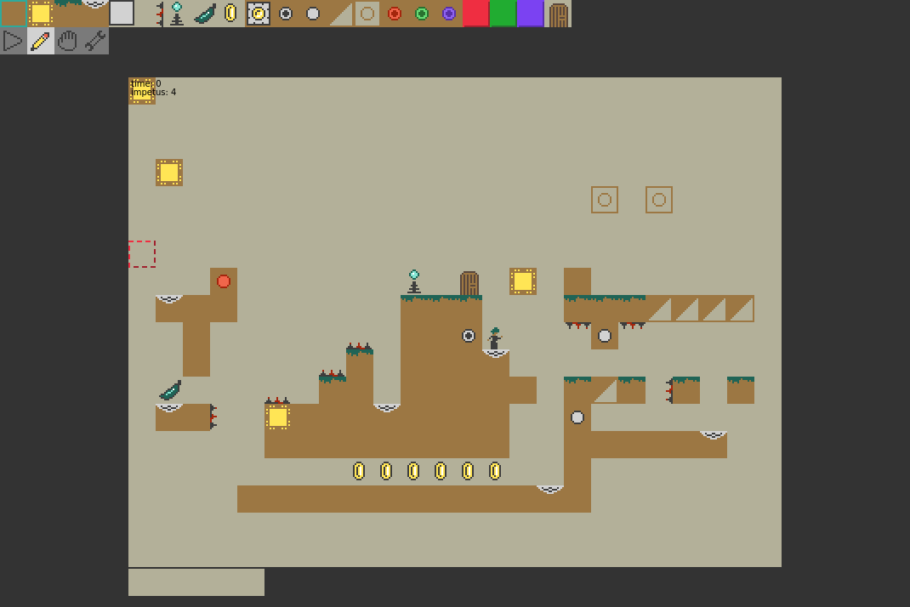

Mount Pyoro
===========
[](https://github.com/jcreedcmu/pyoro/actions/workflows/run-tests.yml)

[](https://jcreedcmu.github.io/pyoro/)
Demo of prototype is [here](https://jcreedcmu.github.io/pyoro/).
Generated Jsdoc documentation is [here](https://jcreedcmu.github.io/pyoro/docs/).

This is an old game idea I've been tinkering with from time to time.
The premise is: puzzle-platformer, but time is discrete, so there's
no need to have good twitch skills.

See [design doc](DESIGN.md) for more.

## Interesting Corner Cases

Should probably turn these into puzzle ideas.

- Diagonal-up pushing of a button
- Diagonal-crossing of a block
- Skimming just behind a phased transient block
- Running off the edge of a platform and then back to get enough
  combo momentum for something

Development
----------

In one shell, you can
```shell
make watch
```
to build the js bundle and in another
```shell
make
```
to start a local server on port 3000.

Browse to http://localhost:3000 to play the game.

Other useful targets in the makefile are
```shell
make test # run unit test on file changes
make check # run typescript typechecker on file changes
```
